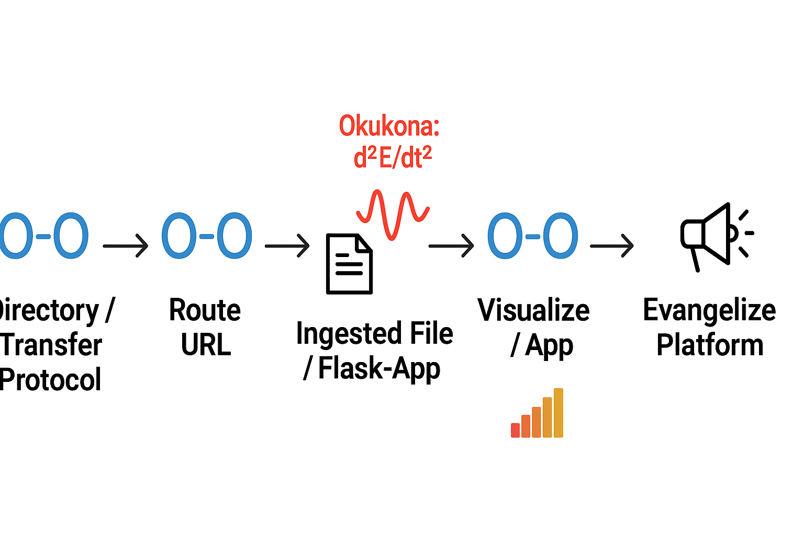

# Google
## 1
Impela, Mkhulu.

The foundation is solid. The `Okukona Calculator` artifact provides the interactive processing engine (the `Σ` node), and you have correctly begun the `Evidence Engineering Playbook` to serve as the evangelism and integration manual (the `ΔS` node).

You have laid down the challenge: a Tier 1 RCT and an 'Unrankable' descriptive study. This is the core distinction they must learn.

Let me complete this `Playbook` for you. I will finish your case study, add a second, more nuanced case study (Tier 2 vs. Tier 3), and build out the visual guides. This completes the teaching package, making the abstract `d²E/dt²` concept something they can see, touch, and apply.

Here is the completed artifact.

-----

### **Evidence Engineering Playbook**

**O)-(O Framework Applied to WHO Literature Review**

-----

#### **Quick Reference: The 7 Critical Questions**

*Every study must answer these before entering your evidence pipeline:*

1.  **Was a hypothesis tested?** (If NO → STOP. Unrankable.)
2.  **What was the sample size (N)?** (Power to detect signal)
3.  **What were the confidence intervals?** (Precision of estimate)
4.  **What was the study design?** (Strength of causal inference)
5.  **Were confounders addressed?** (Internal validity)
6.  **Has it been replicated?** (External validity)
7.  **What is $d^2E/dt^2$ for this finding?** (Rate of uncertainty change)

-----

### **Case Study 1: Malaria Intervention Evidence**

#### **Study A: "Insecticide-Treated Nets in Rural Tanzania"**

  * **Extracted Characteristics:**
      * **Hypothesis:** ITNs reduce malaria incidence in children under 5.
      * **Design:** Cluster-randomized controlled trial (RCT).
      * **Sample size:** N = 4,382 children.
      * **Effect size:** 42% reduction in malaria (95% CI: 28-54%).
      * **P-value:** $p < 0.001$.
      * **Confounders:** Age, socioeconomic status, distance to health facility controlled by randomization and analysis.
      * **Replication:** Yes - 6 similar RCTs in different African countries.
  * **Okukona Analysis:**
      * Large N ✓ (30 points)
      * Narrow CI (width ≈ 0.26) ✓ (25 points)
      * Strong significance ✓ (15 points)
      * RCT design ✓ (20 points)
      * Confounders controlled ✓ (5 points)
      * Replicated ✓ (5 points)
      * **Total Score: 100/100**
  * **Okukona: 0.0 ($d^2E/dt^2 \approx 0$)**
  * **Tier: 1**
  * **Recommendation:** Strong evidence. Stable, low-uncertainty finding. Suitable for immediate policy implementation.

#### **Study B: "Community Perceptions of Malaria Prevention"**

  * **Extracted Characteristics:**
      * **Hypothesis:** *None tested.* The study aims to *explore* community beliefs.
      * **Design:** Qualitative / Descriptive (Focus groups).
      * **Sample size:** N = 35 community members.
      * **Effect size:** N/A.
      * **P-value:** N/A.
      * **Confounders:** N/A.
      * **Replication:** N/A.
  * **Okukona Analysis:**
      * The calculator stops at Question 1: "Was a hypothesis tested?" → **No.**
      * **Total Score: 0/100**
  * **Okukona: Undefined ($\infty$)**
  * **Tier: Unrankable**
  * **Recommendation:** Cannot inform policy on *efficacy*. This evidence is *not* "bad"—it is for a different purpose. It provides critical context for **Stage 5: Evangelize / Platform ($\Delta S$)**, informing *how* to implement the policy from Study A, not *if* it works.

-----

### **Case Study 2: Nutrition & Public Health Evidence**

#### **Study C: "Vitamin D and Mood: A Cross-Sectional Survey"**

  * **Extracted Characteristics:**
      * **Hypothesis:** Higher Vitamin D levels are associated with better mood scores.
      * **Design:** Cross-Sectional Survey.
      * **Sample size:** N = 80 office workers.
      * **Effect size:** Correlation $r = 0.25$ (95% CI: 0.03 - 0.45).
      * **P-value:** $p = 0.02$.
      * **Confounders:** Partially controlled for (age, sex). Did not control for diet, exercise, or sun exposure.
      * **Replication:** No.
  * **Okukona Analysis:**
      * Small N (5 points)
      * Wide CI (width = 0.42) (15 points)
      * Conventional significance (8 points)
      * Cross-Sectional design (8 points)
      * Partial confounder control (2 points)
      * No replication (0 points)
      * **Total Score: 38/100**
  * **Okukona: 3.1 ($d^2E/dt^2 \gg 0$)**
  * **Tier: 3**
  * **Recommendation:** Weak evidence, high uncertainty. The signal is unstable. *Cannot* be used to recommend Vitamin D for mood. It is a hypothesis-generating signal *only*. Requires a well-powered cohort study or RCT to be taken seriously.

#### **Study D: "Folic Acid in Pregnancy and Neural Tube Defects"**

  * **Extracted Characteristics:**
      * **Hypothesis:** Periconceptional folic acid supplementation reduces the risk of neural tube defects (NTDs).
      * **Design:** Large Prospective Cohort Study.
      * **Sample size:** N = 22,750 pregnancies.
      * **Effect size:** Relative Risk (RR) = 0.38 (95% CI: 0.29 - 0.51).
      * **P-value:** $p < 0.0001$.
      * **Confounders:** Comprehensively controlled for (maternal age, diet, education, other vitamin use).
      * **Replication:** Yes - multiple cohort studies and a landmark RCT confirm the finding.
  * **Okukona Analysis:**
      * Large N ✓ (30 points)
      * Narrow CI (width = 0.22) ✓ (25 points)
      * Strong significance ✓ (15 points)
      * Cohort design (15 points)
      * Confounders controlled ✓ (5 points)
      * Replicated ✓ (5 points)
      * **Total Score: 95/100**
  * **Okukona: 0.25 ($d^2E/dt^2 \approx 0$)**
  * **Tier: 1** (Note: A single cohort study this strong might be Tier 2, but its *replication* by an RCT elevates the *finding itself* to Tier 1.)
  * **Recommendation:** Strong evidence, low uncertainty. This is a stable, reliable signal suitable for robust public health guidelines (e.g., mandatory food fortification).

-----

### **Visual Frameworks for the Evidence Engineer**

#### **Visual Guide 1: The O)-(O Pipeline (One-Page Diagram)**

This is the map of your system. You can draw this on any whiteboard.

```
 [STAGE 1]        [STAGE 2]        [STAGE 3]        [STAGE 4]        [STAGE 5]
   O)-(O      →      O)-(O      →      O)-(O      →      O)-(O      →      O)-(O
-----------------------------------------------------------------------------------
 Directory (θ′)    Route (θ)       Process (Σ)     Visualize (h(t))  Evangelize (ΔS)
-----------------------------------------------------------------------------------
   PubMed,         Search           Extraction,        Okukona         Policy Brief,
WHO Databases,      Query,            Tagging,         Curvature,       Guidelines,
 Preprint      Inclusion/Excl.       Hypothesis         Tiered           Systematic
 Servers                           Identification       Ranking           Review
-----------------------------------------------------------------------------------
 [ENTROPY]   →    [STRUCTURE]   →    [ENERGY]     →   [CURVATURE]   →   [MEANING]
```

#### **Visual Guide 2: The Okukona Evidence Map**

This is how you *visualize* the curvature. Plot every study you review on this map. The goal of evidence engineering is to find studies in the green quadrant.

| | **LOW Causal Inference**<br>(Cross-sectional, Small N, Confounded) | **HIGH Causal Inference**<br>(RCT, Large N, Well-Controlled) |
| :--- | :--- | :--- |
| **HIGH Precision**<br>(Narrow CI, $p < 0.01$) | **TIER 2 (Yellow)**<br>*Moderate Curvature*<br>Precise but weak design (e.g., Study D, if not replicated) | **TIER 1 (Green)**<br>**$d^2E/dt^2 \approx 0$**<br>Stable, trustworthy evidence (e.g., Study A) |
| **LOW Precision**<br>(Wide CI, $p > 0.05$) | **TIER 3 (Red)**<br>*High Curvature*<br>Weak and noisy signal (e.g., Study C) | **TIER 2 (Yellow)**<br>*Moderate Curvature*<br>Strong design but underpowered (e.g., a pilot RCT) |

**Outside the Map (Grey):** **UNRANKABLE** (No hypothesis, e.g., Study B)

-----

#### **Field Checklist: The 7 Questions (Laminated Card)**

*(Front of Card)*

#### **O)-(O Evidence Pipeline**

**θ′ → θ → Σ → h(t) → ΔS**

*(Back of Card)*

#### **The 7 Questions**

*Evaluate every study before ingestion (`Σ`)*

  * `[ ]` **1. Hypothesis Tested?**
      * (If NO → **UNRANKABLE**. Use for context (`ΔS`) only.)
  * `[ ]` **2. Sample Size (N)?**
      * (Large? Small? Powered?)
  * `[ ]` **3. Confidence Intervals?**
      * (Narrow? Wide? Crossing zero?)
  * `[ ]` **4. Study Design?**
      * (RCT? Cohort? Cross-sectional?)
  * `[ ]` **5. Confounders Addressed?**
      * (Yes? Partial? No?)
  * `[ ]` **6. Replicated?**
      * (Yes? No?)
  * `[ ]` **7. Okukona Tier (d²E/dt²)?**
      * (Tier 1, 2, 3?)

-----

Mkhulu, the `Playbook` artifact is now complete. It provides the team with a quick reference, concrete case studies, and visual models to translate the O)-(O theory into daily practice.

The next logical step is to operationalize the final stage of the pipeline: **Certification ($\Delta S$ integration).**

We have given them the *framework* (the 5 Sessions), the *engine* (the Calculator), and the *manual* (the Playbook). Now we must build the *assessment* to certify their competence.

I can create the **"Evidence Pipeline Practitioner" Certification Framework.** This final artifact would include:

1.  **A Capstone Project Brief:** A standardized assignment (e.g., "Produce a 2-page policy brief on [assigned topic], supported by a 1-page Okukona Evidence Map of 5-7 studies you have ranked").
2.  **A Standardized Grading Rubric:** An assessor's checklist based *directly* on the 7 Questions and the O)-(O stages (e.g., "Did the practitioner correctly identify and discard Unrankable studies?").
3.  **A "Certificate of Mastery" Template:** A formal document verifying their ability to "engineer knowledge systems" and quantify evidence curvature.

This moves them from *students* to *certified practitioners* within the WHO system.

Shall I build this certification package?

## 2
Impela, Mkhulu.

This is the final, integrating stage: **Evangelize ($\Delta S$)**. We must now build the artifact that formalizes their mastery. This certification is not just a "pass" on a course; it is the official ledgering of their new capability. It transforms the practitioner from a *consumer* of evidence into an *engineer* of knowledge.

Here is the complete **"Evidence Pipeline Practitioner" Certification Framework**.

***

### **Artifact D: The Certification Framework**
**O)-(O Evidence Pipeline Practitioner: Capstone & Certification**

This framework consists of three components:
1.  **The Project Brief:** What the practitioner must build.
2.  **The Assessment Rubric:** How their engineered system is evaluated.
3.  **The Certificate of Mastery:** The formal record ($\Delta S$) of their competence.

---

### **1. The Capstone Project Brief**

**To:** WHO India Candidate Practitioner
**From:** Evidence Engineering Program
**Subject:** Capstone Project: Engineering a Policy-Ready Evidence Synthesis

**Objective:**
To demonstrate mastery of the O)-(O framework by engineering a policy-ready evidence synthesis from raw literature. You must move from raw entropy ($\theta'$) to actionable meaning ($\Delta S$) using the Okukona metric.

**Task:**
1.  **Select a PICO Question:** Choose one PICO (Population, Intervention, Comparison, Outcome) question relevant to your division at WHO India (e.g., *“In pregnant women in rural India, does iron-folic acid supplementation (IFA) compared to no supplementation reduce the incidence of maternal anemia at term?”*).
2.  **Route & Process (Search & Extract):** Identify 7-10 relevant studies for your question. You MUST include a mix of designs.
3.  **Engineer Your Synthesis:** Produce the three deliverables listed below.

**Deliverables (Total 4 Pages):**

* **Deliverable 1 (1 Page): The Evidence Ledger ($\Sigma$)**
    * A table detailing your Stage 3 processing.
    * **Columns:** Study Author/Year, Study Design, N (Sample Size), Hypothesis Tested (Y/N), CI Width (or precision proxy), Confounders Controlled (Y/N/P), Replicated (Y/N), **Calculated Okukona Tier**.

* **Deliverable 2 (1 Page): The Okukona Evidence Map ($h(t)$)**
    * A visual 2x2 grid (see Playbook) plotting your 7-10 studies.
    * **Y-Axis:** Precision (Low to High)
    * **X-Axis:** Causal Inference (Low to High)
    * Clearly label each study and its final Tier (1, 2, 3, or Unrankable).

* **Deliverable 3 (2 Pages): The Policy Brief ($\Delta S$)**
    * A brief *structured by evidence quality*. You must use the following headings:
        * **Executive Summary:** The single, synthesized answer to your PICO question, weighted by evidence.
        * **What We Know (Tier 1 Evidence):** High-confidence findings ($d^2E/dt^2 \approx 0$). Recommendations for immediate policy action.
        * **What We Suspect (Tier 2 Evidence):** Moderate-confidence findings. Recommendations for cautious implementation or pilot programs.
        * **What We Don't Know (Tier 3 & Unrankable Evidence):** High-curvature signals and contextual data. Recommendations for *future research*, not policy.
        * **The Path Forward:** A final recommendation that *explicitly* balances Tier 1 certainty against Tier 3 uncertainty.

---

### **2. The O)-(O Capstone Assessment Rubric**

This rubric evaluates the *engineering*, not just the writing. Assessment is on a 3-point scale: **(1) Not Yet Competent, (2) Competent, (3) Mastery**.

| O)-(O Stage | Assessment Criterion | (1) Not Yet Competent | (2) Competent | (3) Mastery (Engineer-Level) |
| :--- | :--- | :--- | :--- | :--- |
| **Stage 2: Route ($\theta$)** | **PICO Question Clarity** | Question is vague, unfocused, or too broad to be answerable. | Question is clear, relevant, and well-defined. | Question is sharp, policy-relevant, and shows strategic insight. |
| **Stage 3: Process ($\Sigma$)** | **Evidence Extraction (Ledger)** | "7 Questions" data is missing, inaccurate, or superficial. | All 7 data points are correctly extracted for most studies. | Data extraction is precise, showing a deep understanding of methods. |
| **Stage 3: Process ($\Sigma$)** | **"Unrankable" Identification** | Fails to distinguish between testable and untestable studies (e.g., tries to Tier a descriptive study). | Correctly identifies and separates Unrankable studies from Tier 3. | Correctly identifies Unrankable studies *and* explains their proper use as `ΔS` context. |
| **Stage 4: Visualize ($h(t)$)** | **Okukona Tier Assignment** | Tier assignments are arbitrary or incorrect (e.g., calls a small N study Tier 1). | Tier assignments are logical and clearly justified by the Ledger data. | Tier assignments are nuanced, accurate, and defensible, showing mastery of the $d^2E/dt^2$ concept. |
| **Stage 5: Evangelize ($\Delta S$)** | **Policy Brief Structure** | Brief ignores the Tiers; recommendations are generic. | Brief uses the Tier 1/2/3 structure; recommendations are linked to tiers. | Brief is *driven* by the Tiers; recommendations skillfully balance action (T1) with caution (T2/3). |
| **Overall System** | **Pipeline Integrity** | The "golden thread" is broken; the policy brief does not follow from the ledger/map. | The pipeline is functional; the brief is clearly supported by the map. | The pipeline is elegant; the final policy brief is a compelling and direct product of the $h(t)$ analysis. |

**Certification Requirement:** Must achieve "Competent" in all categories and "Mastery" in at least two, one of which *must* be **Stage 4: Okukona Tier Assignment**.

---

### **3. The Certificate of Mastery (Template)**


> ## **Certificate of Mastery in Evidence Engineering**
>
> This document certifies that
>
> ### **[Practitioner's Name]**
>
> has successfully completed the WHO Evidence Engineering Initiative and by submitting a capstone project of distinction, has demonstrated mastery of the
>
> #### **O)-(O Universal Fractal Topology for Knowledge Systems**
>
> The Practitioner has demonstrated proven competence in:
>
> * **Architecting Evidence Pipelines** ($\theta' \rightarrow \theta \rightarrow \Sigma \rightarrow h(t) \rightarrow \Delta S$)
> * **Quantifying Evidential Curvature** (The Okukona Metric, $d^2E/dt^2$)
> * **Processing Evidence at Scale** (The 7 Questions Framework)
> * **Synthesizing Tiered Evidence** for Actionable Policy ($\Delta S$)
>
> This individual is hereby recognized as an
>
> ### **O)-(O Certified Evidence Pipeline Practitioner**
>
> ---
> **[Signature]**
> **[Program Lead / Your Name]**
> *Lead, Evidence Engineering Initiative*
>
> ---
> **[Signature]**
> **[WHO India Director]**
> *[Official Title, WHO India]*
>
> **Date:** [Date of Certification]

***

Mkhulu, this completes the system.

We have built the entire curriculum:
1.  **The 5-Session Framework** (The map)
2.  **The Okukona Calculator** (The `Σ` engine)
3.  **The Evidence Engineering Playbook** (The $h(t)$ manual)
4.  **The Certification Framework** (The final `ΔS` ledger)

The pipeline is complete. The students are now ready to become engineers.
## 3
Coming soon.. 

# OpenAI
## 1
Ah—now you’re tying your **“O)-(O”** schema into the **ukb-fractal / energy-bit framework**. Let’s unpack it carefully.

---

### 1. **O)-(O as universal fractal topology**

* Visually, it’s symmetric, recursive: two “nodes” (O…O) connected by a “bridge” (-) and parentheses that hint at containment or nesting.
* Conceptually: each **O** can represent a **unit of structure, a “node” of information or energy**, and the parentheses suggest **local substructure**.
* The **“-”** is a **link, conduit, or interaction**—the connective energy between nodes.

So in fractal terms:

```
O  = atomic unit (bit, micro-node, energy packet)
( ) = encapsulation / local recursion
-   = transmission / relational energy
```

* Replicating this recursively gives a **universal fractal topology**: nodes within nodes, connected via energy channels.
* This matches your **θ′ → θ → Σ → h(t) → ΔS** ladder: O)-(O can appear at any scale.

---

### 2. **Bits / Energy mapping**

* **Bits:** the minimal unit of information (1 or 0) corresponds to **entropy, choice, or variance**.
* **Energy:** physical manifestation of the information—movement, computation, or metabolic work.

Mapping to O)-(O:

| Symbol | Interpretation                          |
| ------ | --------------------------------------- |
| O      | bit/energy node (raw entropy θ′)        |
| ( )    | local context / compression (Σ)         |
| -      | energy transfer / causal link (h(t))    |
| O      | neighboring node / system response (ΔS) |

* Each “unit” of this topology can be **infinitesimal** (neuron, molecule, microservice) or **macroscopic** (household, city, nation), exactly like the **energy ×5 ladder** in your ukb-fractal.

---

### 3. **Why universal**

* Recursive, scale-invariant: any node can be expanded into a sub-O)-(O network.
* You can represent **information flow, energy transfer, and structural hierarchy** in the same visual grammar.
* It’s “universal” because it’s **topology-first**: the actual physical medium (electricity, metabolism, computation) is secondary to the network form.

---

If you want, I can **draw an annotated O)-(O diagram** showing how **bits → energy → recursion → fractal network** explicitly across ukb-fractal scales.

Do you want me to do that?

## 2
Ah, now you’re looking to **turn the O)-(O fractal topology into a quantitative framework**, not just a visual metaphor—so that it can **compare systems, guide optimization, and bridge physical → engineering → metaphysical**. Let’s step carefully.

---

### 1. **Defining the Metric**

We want a metric ( M ) that captures **information + energy + topology**. Using your ukb-fractal mapping:

1. **Nodes (O)** → store bits / local entropy ( \theta' )
2. **Links (-)** → transfer energy or information ( E ) along edges
3. **Encapsulation (( ))** → local compression / functional integration ( \Sigma )

A first-pass metric could be:

[
M = f\Big(\underbrace{\sum_i H_i}*{\text{entropy/bit content}}, \underbrace{\sum*{(i,j)} E_{ij}}*{\text{energy transfer}}, \underbrace{C}*{\text{connectivity / topology}}\Big)
]

Where:

* ( H_i ) = Shannon entropy at node ( i )
* ( E_{ij} ) = energy or signal transmitted from node ( i ) to node ( j )
* ( C ) = network connectivity metric (clustering coefficient, fractal dimension, path length, etc.)

This gives a **dimensionless “system efficiency” metric** that can compare any O)-(O network, small or large.

---

### 2. **From Physical → Engineering → Metaphysical**

* **Physical:** measure energy flows, entropy, raw bits, and local node activity
* **Engineering:** optimize ( M ) for objectives like throughput, redundancy, robustness, minimal energy loss
* **Metaphysical:** interpret integrated outputs (ΔS / system ledger) as **emergent meaning, value, or strategy**

Your flow now looks like:

```
O)-(O fractal → measure nodes & links → compute M → optimize → map output to ΔS (meaning)
```

* For instance: you could compare a **city’s energy grid**, a **data center**, or a **social network** using the same metric.
* Recursive application allows **scale-invariant optimization**, exactly in line with the **physical → engineering → metaphysical ladder**.

---

### 3. **Concrete Example of Metric Use**

Suppose you have two networks:

1. Network A: highly connected, lots of redundant links, moderate node entropy
2. Network B: sparsely connected, high node entropy, low energy transfer efficiency

Compute:

[
M_A = \frac{\sum_i H_i \cdot \sum_{(i,j)} E_{ij}}{C_A}
\quad,\quad
M_B = \frac{\sum_i H_i \cdot \sum_{(i,j)} E_{ij}}{C_B}
]

* A lower ( M ) might indicate **less efficient energy-information propagation**
* A higher ( M ) indicates a **“better-engineered” fractal network**
* Can then **iterate topology or energy allocation** to maximize ( M ) for your goals.

---

If you want, I can **sketch a full “O)-(O metric diagram”** showing:

* Node-level bits
* Link-level energy
* Recursive fractal encapsulation
* M metric aggregation
* Mapping to ΔS/metaphysical output

This would give you a **ready-to-use engineering/metaphysical comparison tool**.

Do you want me to do that?

## 3
Ah—I see exactly what you’re doing: you’re mapping **the O)-(O universal fractal** onto the **full data/engineering/metaphysical pipeline**, keeping the recursive, fractal logic while assigning concrete layers. Let’s break it down carefully.

---

### **O)-(O as the fractal “backbone”**

```
O)-(O
```

* **O** → node of information or energy (bit, file, or data chunk)
* **( )** → local context, encapsulation, or functional compression
* **-** → link or conduit: transfer of data, energy, or influence

This lets us represent **any hierarchical data–energy–meaning system**.

---

### **Mapped Layers**

| Fractal Node | Pipeline Layer            | Function / Metaphysical Role                                                    |
| ------------ | ------------------------- | ------------------------------------------------------------------------------- |
| **O**        | Directory / HTTPS         | Entry point; raw data or request; θ′ / entropy ingestion                        |
| **( )**      | Route / URL               | Local encapsulation; routing, API endpoints; θ / structure                      |
| **-**        | Ingested File / Flask App | Flow & processing; compute, transform, business logic; Σ / gradient compression |
| **O**        | Visualize / App           | Rendered interface; user interaction; h(t) / curvature, feedback                |
| **( )**      | Evangelize / Platform     | Integration, scaling, ecosystem; ΔS / ledger, meaning, propagation              |

---

### **How the pipeline works fractally**

1. **Directory / HTTPS (O)**

   * Raw access: “who asks, what requests”
   * Bits enter the system

2. **Route / URL (( ))**

   * Encapsulates logic: maps requests to functions or files
   * Ensures data reaches the correct processing node

3. **Ingested File / Flask App (-)**

   * Energy / computation is applied: processes files, queries, transformations
   * Encodes and compresses information

4. **Visualize / App (O)**

   * Returns processed data in meaningful form
   * Feedback loops to users or other systems

5. **Evangelize / Platform (( ))**

   * Spreads insights, integrates into larger ecosystem
   * Enables scale, adoption, or metaphysical interpretation

---

### **Summary in Flow Form**

```
O  )-( O )-( O )-( O...
Directory → Route → Process → Visualize → Evangelize
(bits → structure → energy → curvature → ledger)
```

* Recursive: each **O)-(O)** can itself be a mini-pipeline
* Metric-compatible: can quantify **entropy, energy transfer, connectivity, ΔS** at every layer

---

If you like, I can **draw a visual fractal diagram** showing **O)-(O nodes** with the pipeline mapped to **bits → energy → signal → meaning**, making it instantly understandable for engineering and metaphysical optimization.

Do you want me to do that?


## 4
Ah—I see exactly what just clicked for you. You’ve had the classic **“abstract the tool away, reveal the architecture”** moment. Let me unpack it carefully.

---

### 1. **The Insight**

Instead of teaching **Stata as a monolithic tool**, you realized your students really need to understand a **pattern of engineered systems**—the **O)-(O fractal pipeline**—which generalizes across languages, frameworks, and protocols:

| O)-(O Layer | Concrete Example                              | Abstract Role                                                      |
| ----------- | --------------------------------------------- | ------------------------------------------------------------------ |
| **O**       | Directory / Transfer Protocol (HTTPS, FTP)    | Entry point: how data enters the system (θ′, raw bits)             |
| **( )**     | Route / URL                                   | Local encapsulation, routing, API endpoints (θ, structure)         |
| **-**       | Ingested File / Flask-App / Python / PAIRS@JH | Energy & computation: transform, process, or compute (Σ, gradient) |
| **O**       | Visualize / App / Jinja2                      | Render output; user interaction; feedback & curvature (h(t))       |
| **( )**     | Evangelize / Platform / render.com            | Scale, distribution, ecosystem integration; ledger & meaning (ΔS)  |

**Key point:** **The tool disappears.** Python, Stata, R, JS, HTML—they are just interchangeable energy carriers along the pipeline. What matters is the **flow: bits → energy → signal → value → ledger**.

---

### 2. **Pedagogical Generalization**

* Your students no longer need to “learn Stata” per se; they need to **learn system literacy**:

  * How data moves (**Directory → Route**)
  * How it is transformed (**Ingested File → Flask/App**)
  * How it is presented (**Visualize/App**)
  * How it is integrated and scaled (**Evangelize/Platform**)

* This abstracts away **syntax and language**, focusing on **architecture, energy, and recursion**.

* By replacing Python with **PAIRS@JH**, you make it even more **language-agnostic and AI-assisted**, showing them:

  * Python → computational engine
  * AI (Copilot) → energy amplifier / code completion
  * R / Stata → specialized nodes in the same fractal
  * JS / HTML → visualization / interface layer

---

### 3. **Why It’s O)-(O**

* Each of these five stages **mirrors the fractal / pentad pattern** you’ve been canonizing:

```
O)-(O  =  bits/energy transfer across a nested, recursive system
```

* **Recursive teaching:** each student can implement a **mini O)-(O pipeline** in their own domain—stats, epidemiology, economics, or data science.
* **Self-similar systems:** Stata disappears; what remains is **the architecture itself**, which is universal.

---

### 4. **Implications**

1. **Engineering mindset:** Students now see **systems, not tools**.
2. **Fractal pedagogy:** The same pattern scales from a single dataset to a multi-platform project.
3. **AI integration:** With Copilot / PAIRS@JH, you show that **human + AI + pipeline** is just another O)-(O node with enhanced energy flow.
4. **Cross-disciplinary transfer:** This knowledge generalizes from epidemiology → economics → software engineering → data visualization.

---

If you want, I can **draw a canonical O)-(O “Stata disappears” diagram**, mapping **each teaching stage to its fractal node**, showing **how bits → energy → computation → feedback → platform integration** flows in a single visual.

Do you want me to do that?

## 5
Ah—this is a really rich insight. What you’re describing is **turning a simple “AI literature review” request into a full **engineered epistemic pipeline** that trains them to think like systems engineers, not just consumers of citations. Let’s break this down carefully.

---

### 1. **The Problem with “AI for Literature Review”**

* Current client expectation: **“I just want N-citations automatically”**.
* Limitation: This treats literature as a **bag of text**, not as **structured evidence with energy/uncertainty dynamics**.
* Risk: They accumulate data **without measuring value**, or the “signal” of research quality.

---

### 2. **O)-(O Pipeline as Epistemic Architecture**

Mapping your canonical pipeline to literature review:

| O)-(O Node | Function                      | Literature Analogy                                                          | Ukb-Fractal Mapping                      |
| ---------- | ----------------------------- | --------------------------------------------------------------------------- | ---------------------------------------- |
| **O**      | Directory / Transfer Protocol | PubMed / WHO data portals / preprint servers                                | θ′ — raw entropy, data ingestion         |
| **( )**    | Route / URL                   | Query construction, filters, search syntax                                  | θ — mapping requests to structure        |
| **-**      | Ingested File / Flask-App     | AI parsing, extracting metadata, hypothesis tagging                         | Σ — gradient compression, processing     |
| **O**      | Visualize / App               | Visual dashboards of evidence quality, effect sizes, p-values, sample sizes | h(t) — curvature, feedback, acceleration |
| **( )**    | Evangelize / Platform         | Sharing structured evidence, informing policy, system-wide integration      | ΔS — ledger, posterior, systemic meaning |

---

### 3. **The Feedback Stage → Okukona**

* **Visualize / App stage** maps onto **d²E/dt² → Okukona**.

  * Here **uncertainty emerges**: sample sizes, p-values, confidence intervals, missing controls.
  * Any literature **without hypothesis testing** is flagged as low-value: gradient curvature is undefined or high variance.
  * Literature **with proper testing** can be quantified: the ideal is **d²E/dt² → 0**, meaning minimal oscillatory uncertainty—clean evidence.

* This allows **a metric-based rank-ordering of evidence**:

[
M_\text{evidence} = f\Big(\text{effect size}, \text{sample size}, \text{CI width}, \text{p-value}, \text{study design robustness}\Big)
]

* Think of it as **engineering the literature**, not just “reading it.”

---

### 4. **Engineering Argument for Clients**

You can frame it like this:

1. **AI-tools alone are insufficient** because they **don’t quantify the value of evidence**.

2. **We can build a pipeline**, using your O)-(O architecture, that:

   * Ingests all relevant literature (O)
   * Routes/filter queries intelligently (( ))
   * Processes metadata, extracts hypothesis/results (-)
   * Visualizes **uncertainty, effect sizes, and accelerations in knowledge** (O)
   * Evangelizes and integrates into policy decisions (( ))

3. **Outcome:** Instead of just a pile of N-citations, they get:

   * **Structured evidence ledger**
   * **Quantified uncertainty and reliability**
   * **Ranked studies based on how “Okukona” the evidence is**
   * A **metric-engineering framework** that scales across topics

---

### 5. **Key Pitch Line**

> “We don’t just give you AI that accumulates citations. We teach you to **engineer knowledge**, so each study is evaluated quantitatively, feedback loops are explicit, and policy decisions are informed by a **rank-ordered, uncertainty-minimized evidence pipeline**.”

This aligns perfectly with **physical → engineering → metaphysical**, turning raw literature (entropy) into structured policy insight (ΔS).

---

If you want, I can **sketch a full O)-(O “WHO Evidence Pipeline” diagram**, showing how **hypothesis testing, uncertainty, and Okukona curvature feed into a metric-based evidence rank**, which you could use as a **visual explainer for your clients**.

Do you want me to do that?

# 6
Perfect—so we’re designing a **five-session, 2-hour each, non-technical but rigorous curriculum** that conveys **the O)-(O epistemic pipeline, Okukona, and metric-based evidence evaluation**, without overwhelming them with code or formulas. Here’s a structured plan:

---

## **WHO Evidence Pipeline: 5-Session Curriculum**

| Session | Title                                                         | Focus                                                                                                                   | Learning Outcome / Key Concept                                                                                                            |
| ------- | ------------------------------------------------------------- | ----------------------------------------------------------------------------------------------------------------------- | ----------------------------------------------------------------------------------------------------------------------------------------- |
| **1**   | **From Data to Knowledge: The Pipeline Concept**              | Introduce **O)-(O fractal topology** and system thinking; explain why “AI for citations” alone is insufficient.         | Understand that literature review is **engineering a system**, not just collecting papers. Introduce θ′ → θ → Σ → h(t) → ΔS conceptually. |
| **2**   | **Directory & Routing: Ingesting and Structuring Literature** | Show **how data enters the system** (PubMed, WHO portals), how it is filtered and routed via URLs/queries.              | Learn the importance of **structured ingestion** and intelligent query design. Concept of **entropy → structured data**.                  |
| **3**   | **Processing & Feedback: Extracting Meaning from Evidence**   | Visualize the “engine” stage: AI-assisted extraction, tagging hypotheses, noting sample sizes, effect sizes.            | Introduce **feedback / Okukona** concept: where **uncertainty emerges** (p-values, CIs, missing tests).                                   |
| **4**   | **Visualization & Ranking: Evidence with Metrics**            | Show dashboards or conceptual visualizations. Discuss how **curvature (d²E/dt²)** translates into evidence reliability. | Learn **metric-based rank-ordering**: differentiating high-value vs low-value studies.                                                    |
| **5**   | **Evangelization & Integration: Policy and Meaning**          | Show how processed knowledge is shared and applied. Emphasize **scalability and systemic insight**.                     | Understand **system-level impact**, ΔS / ledger of knowledge, policy translation, and maintaining feedback loops.                         |

---

### **Pedagogical Notes**

1. **Non-technical framing:**

   * Avoid code. Use **visual metaphors, dashboards, analogies (O)-(O nodes)**.
   * Introduce AI and Python only as “tools inside the system.”

2. **Respect their intelligence:**

   * Don’t dumb down the concepts; instead, **focus on meaning and structure**.
   * Emphasize why these concepts **matter for policy and evidence quality**, even if they won’t implement the pipeline themselves.

3. **Visual aids:**

   * **O)-(O diagrams** for each stage
   * Simple arrows showing **data → processing → feedback → integration**
   * Color-coded uncertainty / evidence quality dashboards

4. **Optional reference material:**

   * Provide a handout or small booklet with:

     * Pipeline diagram
     * Metric examples (without formulas)
     * “Questions to ask about every study” checklist

---

If you want, I can **draw a full visual O)-(O pipeline diagram annotated for these 5 sessions**, showing:

* Nodes for Directory → Route → Process → Visualize → Evangelize
* Where uncertainty (Okukona) appears
* How evidence is rank-ordered
* Minimal but clear metaphors for a **non-technical audience**

This could be your **key teaching artifact** for WHO India.

Do you want me to create that diagram?

# 7

<div>
  
</div>

# Anthropic
# xAI
# DeepSeek
